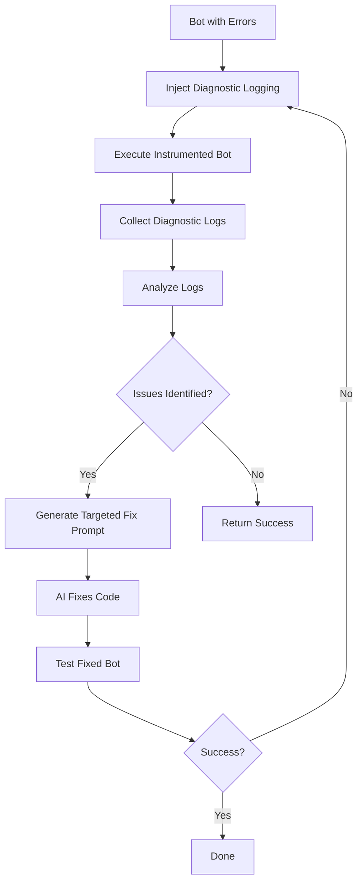

# Improved Code Fixing with Diagnostic Logging

## Overview

The monolithic_agent now uses an intelligent diagnostic approach to fix bot code issues. Instead of blindly attempting fixes, the system:

1. **Instruments the code** - Injects diagnostic logging at strategic points
2. **Runs with diagnostics** - Executes the instrumented version to collect detailed execution data
3. **Analyzes the logs** - Identifies specific issues, their locations, and root causes
4. **Generates targeted fixes** - Uses AI with detailed diagnostic context to make precise fixes

## Architecture

### Components

```
diagnostic_logger.py      - Injects logging into bot code
                            Tracks: imports, functions, data ops, calculations
                            
log_analyzer.py          - Analyzes diagnostic logs
                            Detects: errors, data issues, logic problems
                            Generates: fix prompts with specific guidance
                            
bot_executor.py          - Enhanced with diagnostic execution mode
                            Method: execute_with_diagnostics()
                            
bot_error_fixer.py       - Updated to use diagnostic analysis
                            Uses diagnostic reports to guide fixes
```

### Workflow



## Key Features

### 1. Diagnostic Logging Injection

The `DiagnosticLogInjector` adds logging at:

- **Function entry/exit** - Track execution flow
- **Variable assignments** - Monitor state changes
- **Data operations** - Detect data fetching/processing issues
- **Calculations** - Identify computation errors
- **Error-prone sections** - Extra logging around risky operations

**Example:**

```python
# Original code
def calculate_indicators(data):
    data['SMA'] = data['Close'].rolling(20).mean()
    return data

# Instrumented code
def calculate_indicators(data):
    logger.info("[DIAG] Entering function: calculate_indicators")
    logger.info("[DIAG] Assigned <class 'pandas.Series'> to variable: SMA")
    data['SMA'] = data['Close'].rolling(20).mean()
    logger.info("[DIAG] Exiting function: calculate_indicators")
    return data
```

### 2. Log Analysis

The `LogAnalyzer` examines logs to identify:

- **Import errors** - Missing packages or incorrect imports
- **Runtime errors** - AttributeError, TypeError, ValueError, etc.
- **Data fetch issues** - API failures, empty datasets
- **Logic errors** - Infinite loops, incorrect control flow
- **Incomplete execution** - Functions that didn't complete

**Detected Issue Types:**

| Issue Type | Severity | Examples |
|-----------|----------|----------|
| IMPORT_ERROR | CRITICAL | Missing yfinance, pandas, etc. |
| DATA_FETCH_ERROR | CRITICAL | No data returned from API |
| RUNTIME_ERROR | HIGH | AttributeError, TypeError |
| VARIABLE_ERROR | HIGH | NameError, undefined variables |
| LOGIC_ERROR | HIGH | Infinite loops |
| INCOMPLETE_EXECUTION | HIGH | Bot didn't finish running |

### 3. Diagnostic Reports

Each analysis generates a structured report with:

```python
{
    'success': bool,                    # Overall execution success
    'execution_completed': bool,        # Did bot finish running?
    'issues': [                         # List of identified issues
        {
            'type': str,                # Issue type
            'severity': str,            # critical/high/medium/low
            'description': str,         # What went wrong
            'line_number': int,         # Where (if known)
            'function_name': str,       # Which function
            'suggested_fix': str,       # How to fix it
            'confidence': float,        # 0.0 to 1.0
            'evidence': [str]           # Log excerpts proving issue
        }
    ],
    'functions_executed': [str],        # Functions that ran successfully
    'recommendations': [str],           # High-level guidance
    'fix_prompt': str                   # Detailed prompt for AI fixer
}
```

### 4. Enhanced Fix Workflow

The `BotErrorFixer.iterative_fix()` now:

1. Runs bot with diagnostics (if `use_diagnostics=True`)
2. Gets detailed diagnostic report
3. Uses report to generate targeted fix prompt
4. AI receives:
   - Specific issues identified
   - Evidence from logs
   - Functions that did/didn't execute
   - Targeted recommendations
5. More accurate fixes with fewer iterations

## Usage

### Basic Usage

```python
from Backtest.bot_executor import get_bot_executor

# Execute with diagnostics
executor = get_bot_executor()
result, diagnostic_report = executor.execute_with_diagnostics(
    strategy_file="path/to/bot.py",
    cleanup=True  # Remove diagnostic files after analysis
)

# Check results
if diagnostic_report:
    print(f"Issues found: {len(diagnostic_report['issues'])}")
    for issue in diagnostic_report['issues']:
        print(f"  - [{issue['severity']}] {issue['description']}")
        print(f"    Fix: {issue['suggested_fix']}")
```

### Fixing Errors with Diagnostics

```python
from Backtest.bot_error_fixer import BotErrorFixer
from Backtest.bot_executor import get_bot_executor
from pathlib import Path

# Create fixer
fixer = BotErrorFixer(llm_backend='copilot')

# Fix errors using diagnostic approach
executor = get_bot_executor()
success, fixed_code, history = fixer.iterative_fix(
    bot_file=Path("bot_with_errors.py"),
    bot_executor=executor,
    max_attempts=5,
    use_diagnostics=True  # Enable diagnostic mode
)

if success:
    print("Bot fixed successfully!")
else:
    print(f"Failed after {len(history)} attempts")
```

### API Endpoint

The existing `/api/strategies/{id}/fix_errors/` endpoint now automatically uses diagnostics:

```bash
curl -X POST http://localhost:8000/api/strategies/123/fix_errors/ \
  -H "Content-Type: application/json" \
  -d '{"max_attempts": 5}'
```

The endpoint will:
1. Load the strategy
2. Run with diagnostic logging
3. Analyze logs to identify issues
4. Generate targeted fixes
5. Return fix history

## Configuration

### Enable/Disable Diagnostics

```python
# In bot_error_fixer.iterative_fix()
use_diagnostics = True   # Default: enabled
use_diagnostics = False  # Disable for faster (but less accurate) fixing
```

### Customize Logging Injection

```python
from Backtest.diagnostic_logger import DiagnosticLogInjector

injector = DiagnosticLogInjector(verbose=True)
instrumented_code = injector.inject_logging(
    code=original_code,
    bot_name="my_strategy"
)

# Check injection summary
summary = injector.get_injection_summary()
print(f"Injected {summary['total_points']} logging points")
print(f"By context: {summary['by_context']}")
```

### Customize Log Analysis

```python
from Backtest.log_analyzer import LogAnalyzer

analyzer = LogAnalyzer(verbose=True)
report = analyzer.analyze_log_file(Path("diagnostic_log.log"))

# Generate custom fix prompt
bot_code = Path("bot.py").read_text()
fix_prompt = analyzer.generate_fix_prompt(report, bot_code)
```

## Testing

Run the test suite to verify the system:

```bash
cd AlgoAgent
python test_diagnostic_system.py
```

This will:
1. Create a test bot with a known error
2. Inject diagnostic logging
3. Execute with diagnostics
4. Analyze logs
5. Show identified issues and recommendations

## Benefits

### Before (Blind Fixing)
- AI guesses what's wrong from error messages
- May fix the wrong thing
- Requires many iterations
- Limited context about execution flow

### After (Diagnostic Fixing)
- AI knows exactly what failed and where
- Can see which functions executed successfully
- Gets specific evidence from logs
- Receives targeted recommendations
- Fixes are more accurate with fewer iterations

## Example Output

```
================================================================================
🔍 DIAGNOSTIC EXECUTION: ma_crossover_strategy
================================================================================
Step 1: Injecting diagnostic logging...
✓ Created diagnostic version: ma_crossover_strategy_diagnostic.py
  Injected 15 diagnostic points

Step 2: Executing diagnostic version...
Executing Bot: ma_crossover_strategy_diagnostic
[ERROR] Execution completed with errors: AttributeError: 'DataFrame' object has no attribute 'close'

Step 3: Analyzing diagnostic logs...
Found log file: diagnostic_log_20260201_100530.log
✓ Analysis complete: 2 issues found
  [high] Attribute not found: 'DataFrame' object has no attribute 'close'
      Fix: Check object type and available attributes. Verify data structure.
  [high] Bot execution did not complete
      Fix: Fix errors preventing complete execution
================================================================================

Diagnostic Report:
  Issues found: 2
  Execution completed: False
  Functions executed: ['fetch_data']

  Issue 1:
    Type: runtime_error
    Severity: high
    Description: Attribute not found: 'DataFrame' object has no attribute 'close'
    Fix: Check object type and available attributes. Use 'Close' instead of 'close'

  Recommendations:
    - ⚠️ Fix 1 critical issue(s) first before running bot
    - 🐛 Fix runtime errors by checking variable types and object attributes
```

## Troubleshooting

### Diagnostic files not cleaned up

```python
# Manually clean up
import os
from pathlib import Path

for f in Path("Backtest").glob("*_diagnostic.py"):
    f.unlink()
for f in Path("Backtest").glob("diagnostic_log_*.log"):
    f.unlink()
```

### Diagnostics not working

Check that modules are importable:

```python
try:
    from Backtest.diagnostic_logger import DiagnosticLogInjector
    from Backtest.log_analyzer import LogAnalyzer
    print("✓ Diagnostic modules available")
except ImportError as e:
    print(f"✗ Import error: {e}")
```

### Analysis not finding issues

Verify log file contains diagnostic output:

```bash
# Check log file
cat diagnostic_log_*.log | grep "\[DIAG\]"
```

## Future Enhancements

1. **Machine Learning** - Learn from past fixes to improve analysis
2. **Performance Profiling** - Add timing data to identify bottlenecks
3. **Visual Reports** - Generate HTML reports with execution timelines
4. **Integration Tests** - Auto-test after fixes to verify success
5. **Comparative Analysis** - Compare diagnostic runs before/after fixes

## Related Files

- `AlgoAgent/monolithic_agent/Backtest/diagnostic_logger.py` - Logging injection
- `AlgoAgent/monolithic_agent/Backtest/log_analyzer.py` - Log analysis
- `AlgoAgent/monolithic_agent/Backtest/bot_executor.py` - Enhanced executor
- `AlgoAgent/monolithic_agent/Backtest/bot_error_fixer.py` - Updated fixer
- `AlgoAgent/test_diagnostic_system.py` - Test suite
