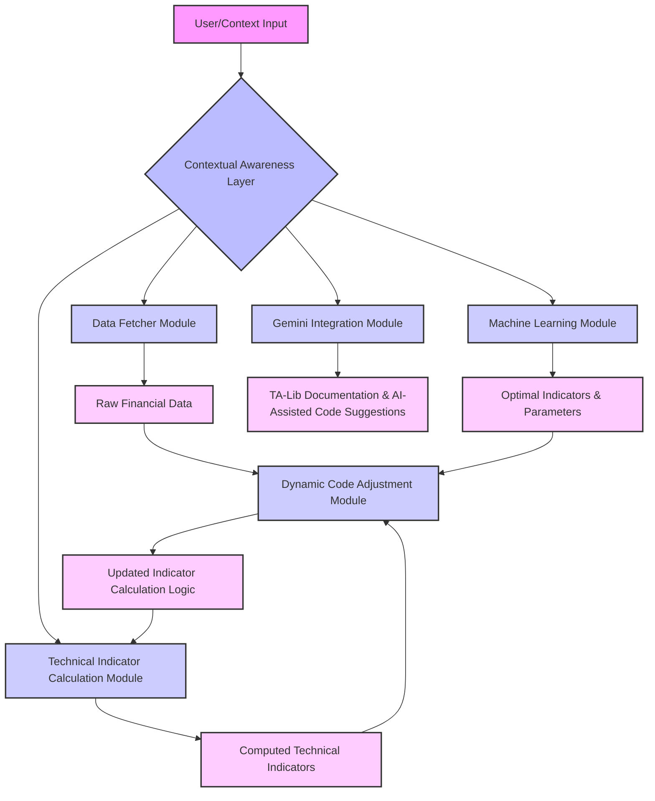

# Dynamic Data Ingestion Model for Financial Securities

## Objective

This model is designed to provide a dynamic data ingestion pipeline capable of automatically fetching financial security data, computing technical indicators, and intelligently adapting its calculations and code based on contextual input. It leverages AI for dynamic code adjustments and machine learning for optimal indicator selection, aiming for a scalable and efficient solution without extensive manual code changes.

## Architecture Overview

The model follows a modular architecture, ensuring clear separation of concerns and facilitating maintainability and extensibility. The core components interact as follows:



## Module-wise Breakdown

### 1. Context Manager
- **File:** [`AlgoAgent/Data/context_manager.py`](AlgoAgent/Data/context_manager.py)
- **Class:** `ContextManager`
- **Purpose:** Manages the operational context of the model, including the financial security ticker, required technical indicators, data fetching periods, and intervals. It acts as a central repository for dynamic configuration.
- **Key Functions:**
    - `set_context(key, value)`: Stores a key-value pair in the context.
    - `get_context(key, default)`: Retrieves a value from the context.
    - `update_context(new_context)`: Updates the entire context with a dictionary.
    - `get_required_indicators()`: Retrieves the list of indicators to be calculated.
    - `set_required_indicators(indicators)`: Sets the list of required indicators.
    - `get_security_ticker()`: Retrieves the current security ticker.
    - `set_security_ticker(ticker)`: Sets the current security ticker.

### 2. Data Fetcher Module
- **File:** [`AlgoAgent/Data/data_fetcher.py`](AlgoAgent/Data/data_fetcher.py)
- **Class:** `DataFetcher`
- **Purpose:** Responsible for fetching historical financial data for specified securities from external sources (e.g., Yahoo Finance via `yfinance`).
- **Key Functions:**
    - `fetch_historical_data(ticker, period, interval)`: Fetches data for a given period and interval.
    - `fetch_data_by_date_range(ticker, start_date, end_date, interval)`: Fetches data within a specific date range.

### 3. Technical Indicator Calculation Module
- **File:** [`AlgoAgent/Data/indicator_calculator.py`](AlgoAgent/Data/indicator_calculator.py)
- **Class:** `IndicatorCalculator`
- **Purpose:** Computes a wide array of technical indicators using the `TA-Lib` library based on the fetched financial data and a list of specified indicators. This module is designed to be dynamically updated.
- **Key Function:**
    - `calculate_indicators(data, indicators)`: Takes a DataFrame and a list of indicator specifications, returning the DataFrame augmented with calculated indicator columns.

### 4. Machine Learning Model Selector
- **File:** [`AlgoAgent/Data/ml_model_selector.py`](AlgoAgent/Data/ml_model_selector.py)
- **Class:** `MLModelSelector`
- **Purpose:** Utilizes machine learning models (e.g., `RandomForestClassifier` from `scikit-learn`) to dynamically determine the most effective technical indicators and their optimal parameters for a given financial security.
- **Key Functions:**
    - `train_model(data, target_column, feature_columns)`: Trains an ML model using historical data and indicators.
    - `predict_optimal_indicators(current_data, feature_columns)`: Predicts and suggests optimal indicators or parameters based on the trained model.

### 5. Gemini Integration Module
- **File:** [`AlgoAgent/Data/gemini_integrator.py`](AlgoAgent/Data/gemini_integrator.py)
- **Class:** `GeminiIntegrator`
- **Purpose:** Interacts with Google's Gemini API to assist in understanding TA-Lib documentation and generating AI-assisted code snippets for new or updated indicators.
- **Key Functions:**
    - `get_talib_indicator_info(indicator_name)`: Fetches detailed information about a specific TA-Lib indicator.
    - `suggest_code_update(current_code, required_indicator_spec)`: Generates a Python code snippet for a new/updated indicator to be inserted into `indicator_calculator.py`.

### 6. Dynamic Code Adjustment Module
- **File:** [`AlgoAgent/Data/dynamic_code_adjuster.py`](AlgoAgent/Data/dynamic_code_adjuster.py)
- **Class:** `DynamicCodeAdjuster`
- **Purpose:** Intelligently modifies the `indicator_calculator.py` file by inserting or updating code snippets for technical indicator calculations. It uses Python's `ast` module for parsing and unparsing code to ensure structural integrity.
- **Key Function:**
    - `update_indicator_calculation_logic(current_indicator_calculator_code, new_indicator_snippet)`: Inserts a new code snippet into the `calculate_indicators` method of the `indicator_calculator.py` file.

### 7. Main Data Ingestion Model
- **File:** [`AlgoAgent/Data/main.py`](AlgoAgent/Data/main.py)
- **Class:** `DataIngestionModel`
- **Purpose:** The orchestrator of the entire data ingestion pipeline. It initializes all modules, manages the flow of data, triggers dynamic code adjustments, and integrates ML-driven insights.
- **Key Functions:**
    - `_check_and_update_indicator_logic(required_indicators)`: Internal method to check for missing indicators and trigger Gemini for code suggestions and dynamic code adjustment.
    - `_read_indicator_calculator_code()`: Reads the content of `indicator_calculator.py`.
    - `_write_indicator_calculator_code(content)`: Writes updated content to `indicator_calculator.py`.
    - `ingest_and_process(ticker, required_indicators, period, interval, ml_feature_columns, ml_target_column)`: The main public method that executes the entire data ingestion and processing workflow.

## Data Flow

1.  **User/Context Input:** The process begins with user-defined context, typically a financial `ticker` and a list of `required_indicators` (e.g., `[{'name': 'SMA', 'timeperiod': 20}]`). This input is managed by the `ContextManager` (`AlgoAgent/Data/context_manager.py`).
2.  **Raw Financial Data Fetching:** The `DataFetcher` (`AlgoAgent/Data/data_fetcher.py`) retrieves historical OHLCV (Open, High, Low, Close, Volume) data for the specified `ticker` and `period`/`interval`. This raw data is a `pandas.DataFrame`.
3.  **Indicator Logic Check & Update:** Before calculation, the `DataIngestionModel` (`AlgoAgent/Data/main.py`) checks if all `required_indicators` are implemented in the `IndicatorCalculator` (`AlgoAgent/Data/indicator_calculator.py`).
    *   If an indicator is missing, the `GeminiIntegrator` (`AlgoAgent/Data/gemini_integrator.py`) is prompted to `suggest_code_update()` for that indicator.
    *   The generated code snippet is then used by the `DynamicCodeAdjuster` (`AlgoAgent/Data/dynamic_code_adjuster.py`) to `update_indicator_calculation_logic()` within `indicator_calculator.py`, effectively modifying the code on the fly.
4.  **Technical Indicator Calculation:** The `IndicatorCalculator` (`AlgoAgent/Data/indicator_calculator.py`) takes the raw financial data and the (potentially updated) list of `required_indicators` to compute and append new columns for each indicator to the `pandas.DataFrame`.
5.  **Machine Learning for Optimal Indicators:** The `MLModelSelector` (`AlgoAgent/Data/ml_model_selector.py`) can optionally `train_model()` and `predict_optimal_indicators()` based on the data with computed indicators. This generates `Optimal Indicators & Parameters` which can inform future `required_indicators`.
6.  **Processed Data Output:** The final output is a `pandas.DataFrame` containing the raw financial data augmented with all calculated technical indicators.

## Logic Flow

1.  **Initialization:** An instance of `DataIngestionModel` is created, which in turn initializes instances of `ContextManager`, `DataFetcher`, `IndicatorCalculator`, `MLModelSelector`, `GeminiIntegrator`, and `DynamicCodeAdjuster`.
2.  **Ingestion Request:** The `ingest_and_process()` method of `DataIngestionModel` is called with the `ticker`, `required_indicators`, and other parameters.
3.  **Context Setting:** The `ContextManager.set_security_ticker()` and `ContextManager.set_required_indicators()` methods are used to store the current operational context.
4.  **Data Retrieval:** `DataFetcher.fetch_historical_data()` is invoked to get the raw financial data.
5.  **Dynamic Code Check:** `DataIngestionModel._check_and_update_indicator_logic()` is called.
    *   It reads the current `indicator_calculator.py` code.
    *   For each `required_indicator`, it checks if the indicator's logic is present.
    *   If not, `GeminiIntegrator.suggest_code_update()` is called to get a new code snippet.
    *   `DynamicCodeAdjuster.update_indicator_calculation_logic()` then modifies the `indicator_calculator.py` file with the new snippet.
    *   If changes were made, `indicator_calculator.py` is rewritten.
6.  **Indicator Calculation:** `IndicatorCalculator.calculate_indicators()` is called with the fetched data and the (potentially updated) list of `required_indicators`.
7.  **ML Integration (Optional):** If `ml_feature_columns` and `ml_target_column` are provided, `MLModelSelector.train_model()` and `MLModelSelector.predict_optimal_indicators()` are executed. The suggestions from the ML model can be used to refine future `required_indicators`.
8.  **Return Processed Data:** The `ingest_and_process()` method returns the `pandas.DataFrame` with all raw data and calculated indicators.

## Setup and Usage

### Prerequisites

*   Python 3.8+
*   A Google Gemini API Key

### Installation

1.  **Navigate to the project directory:**
    ```bash
    cd AlgoAgent/Data
    ```
2.  **Install Python dependencies:**
    ```bash
    pip install -r requirements.txt
    ```
    **Note on TA-Lib:** TA-Lib requires a separate installation of its C library before the Python wrapper can be installed.
    *   **Windows:** Download `ta-lib-0.4.0-msvc.zip` from [TA-Lib.org](https://ta-lib.org/hdr_dw.html), unzip it to `C:\ta-lib`, and then `pip install TA-Lib`.
    *   **Linux/macOS:** Typically, you can install it via your package manager (e.g., `sudo apt-get install libta-lib-dev` on Debian/Ubuntu, `brew install ta-lib` on macOS) and then `pip install TA-Lib`.

### Configuration

1.  **Gemini API Key:** Set your Gemini API key as an environment variable named `GEMINI_API_KEY`.
    *   **Linux/macOS:**
        ```bash
        export GEMINI_API_KEY="YOUR_GEMINI_API_KEY"
        ```
    *   **Windows (Command Prompt):**
        ```bash
        set GEMINI_API_KEY="YOUR_GEMINI_API_KEY"
        ```
    *   **Windows (PowerShell):**
        ```powershell
        $env:GEMINI_API_KEY="YOUR_GEMINI_API_KEY"
        ```

### Running the Model

Execute the `main.py` script from the `AlgoAgent/Data` directory:

```bash
python main.py
```

The `main.py` script includes example usage that demonstrates:
1.  Fetching data and calculating initial indicators for AAPL.
2.  Fetching data for GOOG with an additional indicator (ADX) that might trigger the dynamic code adjustment mechanism if not already present in `indicator_calculator.py`.

Observe the console output for messages regarding data fetching, indicator calculation, and any dynamic code adjustments made by Gemini.